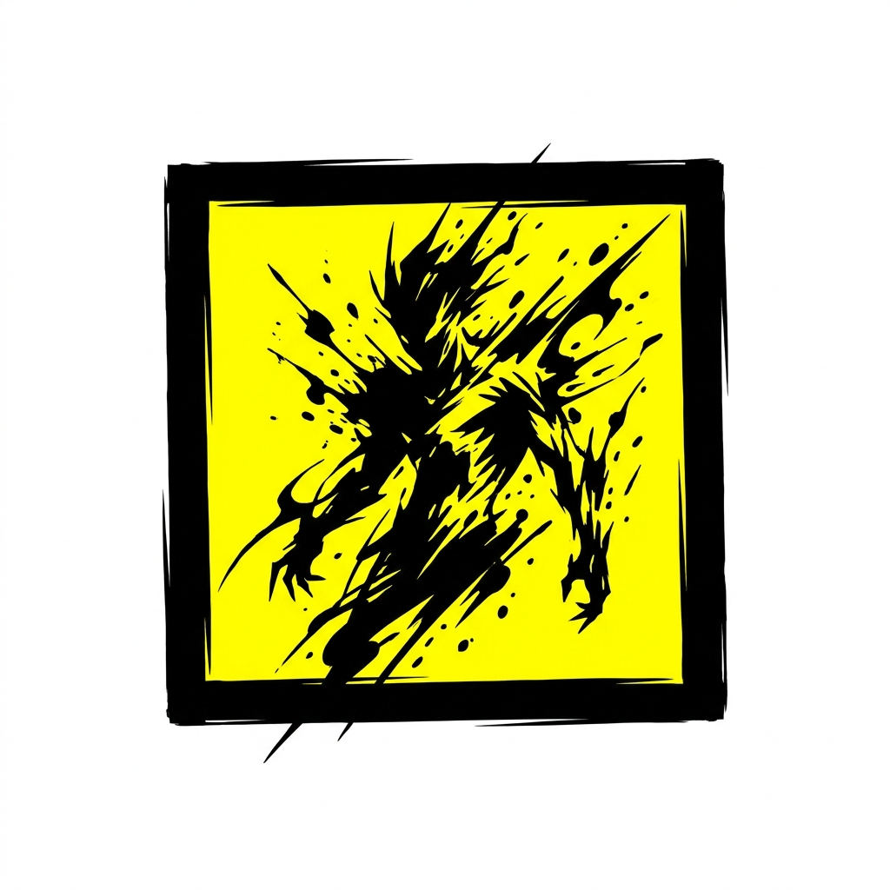

<div align="center">



# ⚡ SOULPAD

### *The New Era of Storytelling*

<br/>

[](https://nextjs.org)
[](https://react.dev)
[](https://typescriptlang.org)
[](https://fastapi.tiangolo.com)
[](https://postgresql.org)
[](https://supabase.com)

<br/>

> **"Where stories don't just live — they breathe, burn, and bleed."**  
> A premium storytelling platform engineered for writers who demand cinematic quality and readers who crave immersive worlds.

<br/>

[](https://stoery.vercel.app)
[](https://github.com/techxsarwar/stoery)

</div>

---

## 🖼️ Platform Preview

<div align="center">

</div>

---

## 🌟 What Makes SOULPAD Different?

> Most story platforms are digital libraries. **SOULPAD is a universe.**

| Feature | SOULPAD ✅ | Wattpad ❌ | Royal Road ❌ | Medium ❌ |
|---|:---:|:---:|:---:|:---:|
| **Dedicated AI Writing Engine** | ✅ Streaming | ❌ None | ❌ None | ❌ None |
| **AI Originality Checker** | ✅ Built-in | ❌ None | ❌ None | ❌ None |
| **Story Licensing System** | ✅ Full | ❌ None | ❌ None | ❌ None |
| **Reading Streak & Heartbeat** | ✅ Yes | ❌ No | ❌ No | ❌ No |
| **PiracyGuard Content Protection** | ✅ Yes | ❌ No | ❌ No | ❌ No |
| **The Codex (World-building Tool)** | ✅ Yes | ❌ No | ❌ No | ❌ No |
| **The Nexus (Community Chat)** | ✅ Yes | ❌ No | ❌ No | ❌ No |
| **Brutalist Cinematic Design** | ✅ Yes | ❌ Generic | ❌ Generic | ❌ Generic |
| **Framer Motion Transitions** | ✅ Yes | ❌ No | ❌ No | ❌ No |
| **Smooth Scroll (Lenis)** | ✅ Yes | ❌ No | ❌ No | ❌ No |
| **Author Monetization Pipeline** | ✅ Yes | 🟡 Limited | 🟡 Limited | 🟡 Limited |
| **Verified Chronicler Status** | ✅ Yes | ❌ No | ❌ No | ❌ No |
| **Dark Mod-only Cinematic UI** | ✅ Yes | ❌ No | ❌ No | ❌ No |
| **Staff Appeal & Moderation System** | ✅ Full | 🟡 Basic | 🟡 Basic | 🟡 Basic |
| **Reader Badge System** | ✅ Yes | ❌ No | ❌ No | ❌ No |
| **Multi-chapter Story Structure** | ✅ Yes | ✅ Yes | ✅ Yes | ❌ No |
| **AWS S3 Media Storage** | ✅ Yes | ❌ No | ❌ No | ❌ No |

---

## ✨ Core Features — Deep Dive

### 🧠 1. Dedicated AI Engine (Gemini-Powered)

> **This isn't a ChatGPT wrapper. It's a high-concurrency literary microservice.**

Our FastAPI + Gunicorn AI engine runs as an independent microservice on Render, completely decoupled from the frontend for maximum performance:

- ⚡ **Real-time Streaming** — AI "types" story suggestions live using `StreamingResponse`, word by word
- ✍️ **Story Continuation** — Context-aware, atmosphere-matched story continuation in dark-fantasy style
- 🪄 **Prose Polish** — Elevates your prose without changing the plot; grammar-corrected, atmosphere-enhanced
- 🏷️ **AI Title Generator** — Get 5 cinematic, evocative title suggestions based on your story content
- 📝 **Synopsis Writer** — Auto-generates a compelling 2–3 sentence blurb with a reader hook
- 🛡️ **Originality Checker** — Full plagiarism analysis: originality score (0–100), verdict, flags, strengths, and publish recommendation
- 🤖 **Model Failover** — Auto-falls back from `gemini-2.0-flash` → `gemini-1.5-pro` if primary fails

---

### 🌊 2. Cinematic Motion Experience

> **Built to feel like a premium agency site, not a blog platform.**

- 🖱️ **Lenis Smooth Scroll** — Momentum-based, butter-smooth scrolling on every device
- 🎭 **Framer Motion v12** — Seamless page transitions, entrance animations, staggered card reveals
- 🌑 **Deep Dark Aesthetic** — Base `#131315` charcoal palette with tonal layering (no flat blacks)
- 🟨 **Electric Yellow Brand** — `#FFD700` primary accents with signature purple gradients (`#d0bcff → #a078ff`)
- 🪟 **Frosted Obsidian Glass** — Navigation and modals use `backdrop-filter: blur(20px)` for a premium feel
- ✨ **Signature Glows** — Interactive elements emit `0 0 15px` primary-colored ambient glows

---

### 📖 3. Advanced Reader Experience

- 🚫 **PiracyGuard™** — Anti-copy content protection layer baked into the reader; prevents text selection and screenshotting
- ⏱️ **Reading Heartbeat** — Passive server pings track your reading time in real time, updated to your profile
- 📈 **Reading Streaks** — Daily reading streaks and longest-streak records tracked per user
- 🔖 **Scroll Progress Sync** — Your exact scroll position in every chapter is saved and resumed automatically
- 📚 **Distraction-Free Mode** — High-contrast typography-focused reading interface using `Newsreader` serif font
- 🔔 **Smart Notifications** — In-app notifications for new chapters, badge earnings, license approvals, and comment replies

---

### ✍️ 4. Professional Writing Studio

- 🖊️ **TipTap Rich Editor v3** — Block-based, extensible writing editor with full formatting support
- 🤖 **Inline AI Toolbar** — Continue, polish, generate titles and synopses without leaving the editor
- 📋 **Multi-Chapter Management** — Organize stories into ordered chapters with individual titles and content
- 🖼️ **AWS S3 Cover Uploads** — Directly upload high-res story covers to AWS S3; no third-party image hosting
- 📊 **Story Dashboard** — View reads, likes, and status (Published / Paused / Draft) per story
- 🛡️ **Originality Report** — Run a full AI plagiarism check before publishing, with a score and structured flags

---

### 🏛️ 5. The Codex — World-Building Tool

> **A private wiki inside your writing studio, exclusive to SOULPAD.**

- 📦 **Categorized Entries** — Create lore entries for Characters, Locations, Events, Magic Systems, and more
- 🔒 **Private by Default** — Entries are hidden from readers; only you see your world-building notes
- 🖼️ **Image Support** — Attach reference images to any Codex entry
- 🔗 **Linked to Stories** — Each Codex lives in context of your author profile

---

### 💬 6. The Nexus — Live Community Hub

> **Real-time community messages, not just comment sections.**

- 🌐 **Global Community Feed** — Writers and readers interact in a shared, real-time message stream
- 👤 **Author-linked Posts** — Every message is tied to a verified profile with avatar and pen name
- ❤️ **Post Likes** — Engage with community posts directly

---

### 📜 7. Story Licensing System

> **No other story platform offers this. SOULPAD does.**

- 📃 **License Applications** — Authors can formally license their stories with legal name, license type, and details
- 🔢 **Unique License Numbers** — Each approved license gets a unique, permanent license number
- ⚖️ **Staff Review Pipeline** — Internal staff team reviews, approves, or rejects licensing requests
- 🔐 **IP Protection** — Establishes an on-platform legal record for your intellectual property

---

### 👑 8. Author Monetization

- 💰 **Monetization Pipeline** — Apply for monetization with bank details, PAN, and legal name verification
- 📊 **Status Tracking** — Real-time monetization status: `NONE → ELIGIBLE → APPLIED → APPROVED`
- 👶 **Guardian Approval** — Underage authors require guardian approval for monetization
- 🏦 **Bank Account Management** — Securely store account holder name, account number, and IFSC code

---

### 🛡️ 9. Moderation & Safety

- 🚩 **Story Reporting** — Readers can report stories with typed reasons and detailed descriptions
- ⛔ **Story Banning** — Staff can ban stories temporarily or permanently with reasons and expiry dates
- 📢 **Author Appeals** — Banned authors can submit appeals; staff can Accept or Reject with tracked status
- 👻 **Shadow Banning** — Toxic comments can be shadow-banned (visible only to the commenter)
- 👨‍💼 **Role System** — Four-tier role system: `AUTHOR`, `EMPLOYEE`, `MANAGER`, `ADMIN`

---

### 🏅 10. Badges & Gamification

- 🏆 **Achievement Badges** — Earn badges like `SCHOLAR_OF_VOID`, `FIRST_BLOOD`, and more for platform milestones
- 📅 **Reading Streaks** — Track daily and longest-ever reading streaks
- ⭐ **Story Reviews** — Structured 1–5 star reviews with title and content per story (one per user)
- 📖 **Reading History** — Full reading history with scroll progress preserved per story

---

### 🔍 11. Discovery Engine

- 🏷️ **Genre Filtering** — Browse by Sci-Fi, Fantasy, Mystery, Romance, Horror, and more
- 🔥 **Trending Stories** — Real-time tracking of global reads and likes to surface hot content
- 🆕 **New Arrivals** — Discover freshly published stories from the community
- 🔎 **Search** — Full-text story search across title, genre, and author

---

### 👤 12. Author Profiles

- ✅ **Verified Chronicler Badge** — Verified authors get a special badge displayed on their profile
- 👥 **Follow System** — Follow authors; view follower and following counts
- 📰 **Author Posts** — Share blog-style posts and story updates with your followers
- 🖼️ **Pen Name & Avatar** — Full custom identity separate from your account email

---

## 🛠️ Technical Architecture

```
┌─────────────────────────────────────────────────────────┐
│                     SOULPAD PLATFORM                    │
├────────────────────┬────────────────────────────────────┤
│   FRONTEND         │   AI MICROSERVICE                  │
│   Next.js 16.2     │   FastAPI + Gunicorn               │
│   React 19         │   Gemini 2.0 Flash (Primary)       │
│   TypeScript 5     │   Gemini 1.5 Pro (Fallback)        │
│   Turbopack        │   Streaming Responses              │
├────────────────────┼────────────────────────────────────┤
│   DATABASE         │   AUTH                             │
│   PostgreSQL       │   Supabase Auth                    │
│   Prisma ORM v6    │   NextAuth.js v4                   │
│   Type-safe Models │   Multi-Provider SSO               │
├────────────────────┼────────────────────────────────────┤
│   STORAGE          │   DESIGN SYSTEM                    │
│   AWS S3           │   Vanilla CSS + Tailwind v4        │
│   Story Covers     │   Space Grotesk + Newsreader       │
│   Codex Images     │   Framer Motion v12                │
│   Avatar Uploads   │   Lenis Smooth Scroll              │
└────────────────────┴────────────────────────────────────┘
```

| Layer | Technology | Version | Purpose |
|:---|:---|:---|:---|
| **Frontend Framework** | Next.js | `16.2.4` | SSR, Edge delivery, App Router |
| **UI Library** | React | `19.2.4` | Component rendering |
| **Language** | TypeScript | `^5` | End-to-end type safety |
| **AI Microservice** | FastAPI + Gunicorn | Latest | High-concurrency AI streaming |
| **AI Model** | Google Gemini | `2.0-flash` / `1.5-pro` | Story generation & analysis |
| **Database** | PostgreSQL | Latest | Persistent relational storage |
| **ORM** | Prisma | `^6.19.3` | Type-safe DB queries & migrations |
| **Auth** | Supabase + NextAuth | `^0.10.2` | Secure multi-provider auth |
| **Storage** | AWS S3 SDK | `^3.1032.0` | Media file storage |
| **Rich Text Editor** | TipTap | `^3.22.4` | Story writing editor |
| **Animations** | Framer Motion | `^12.38.0` | Page transitions & UI animations |
| **Scroll Physics** | Lenis | `^1.3.23` | Smooth momentum scrolling |
| **Icons** | Lucide React | `^1.8.0` | UI iconography |
| **Content Security** | DOMPurify | `^3.4.1` | XSS sanitization for story HTML |

---

## 🎨 Design Language — The Cinematic Codex

> *"We are not building a SaaS dashboard. We are building an immersive environment for high-end storytelling."*

### Color Palette

| Token | Value | Usage |
|:---|:---|:---|
| `surface` | `#131315` | Base page background (deep charcoal, not flat black) |
| `surface_container_low` | `#1c1b1d` | Secondary sections, sidebars |
| `surface_container_high` | `#2a2a2c` | Cards, interactive elements |
| `surface_container_highest` | `#353437` | Active / elevated elements |
| `primary` | `#d0bcff` | Primary accent, CTAs, glow source |
| `primary_container` | `#a078ff` | Gradient endpoint, secondary accent |
| `brand_yellow` | `#FFD700` | Logo color, key brand highlights |

### Typography

| Role | Font | Usage |
|:---|:---|:---|
| **Headline / Display** | `Space Grotesk` | UI labels, navigation, headers |
| **Narrative / Body** | `Newsreader` | All story content, long-form text |
| **Metadata / Micro-copy** | `Inter` | Tags, timestamps, badges |

### Design Principles

- 🚫 **No 1px Borders** — Structure is defined through background color shifts, not lines
- 🌫️ **Frosted Glass** — Navbars and modals use `backdrop-filter: blur(20px)` at 60% opacity
- 🌊 **Tonal Layering** — Depth through background shifts, not drop shadows on cards
- ⚡ **Glow Effects** — Primary interactive elements emit `0 0 15px` ambient purple glow
- 📐 **Intentional Asymmetry** — Titles deliberately offset from body text for editorial tension

---

## 🗂️ Project Structure

```
stoery/
├── src/
│   ├── app/                    # Next.js App Router
│   │   ├── (legal)/            # Terms, Privacy, Accessibility pages
│   │   ├── about/              # About SOULPAD page
│   │   ├── auth/               # Login & Registration flows
│   │   ├── author/             # Author public profile pages
│   │   ├── careers/            # Careers at SOULPAD
│   │   ├── changelog/          # Platform changelog
│   │   ├── community/          # The Nexus community hub
│   │   ├── contact/            # Contact page
│   │   ├── dashboard/          # Writer's dashboard
│   │   ├── discover/           # Story discovery & genre browsing
│   │   ├── faq/                # FAQ page
│   │   ├── feed/               # Personalized story feed
│   │   ├── guide/              # Platform guide & tutorials
│   │   ├── library/            # Reader's personal library
│   │   ├── manager/            # Story & chapter management
│   │   ├── monetization/       # Monetization application
│   │   ├── onboarding/         # New user onboarding flow
│   │   ├── post/               # Author posts
│   │   ├── profile/            # User profile settings
│   │   ├── read/               # Story reader interface
│   │   ├── staff/              # Staff moderation panel
│   │   ├── u/                  # Public user pages
│   │   └── verify/             # Email verification
│   ├── actions/                # Next.js Server Actions
│   ├── components/             # Shared React components
│   ├── lib/                    # Prisma client, utilities
│   ├── providers/              # React context providers
│   ├── types/                  # TypeScript type definitions
│   └── utils/                  # Helper functions
├── backend/
│   ├── main.py                 # FastAPI AI Engine
│   └── requirements.txt        # Python dependencies
├── prisma/
│   └── schema.prisma           # Full database schema (20 models)
└── public/
    ├── logo.png                # SOULPAD brand logo
    ├── og-banner.png           # Open Graph banner
    └── hero-graphic.png        # Hero section graphic
```

---

## 🗄️ Database Models

```
User ──── Profile ──┬── Story ──── Chapter
                    ├── Like
                    ├── Comment (shadow-ban support)
                    ├── CodexEntry (world-building)
                    ├── NexusMessage (community)
                    ├── License (IP protection)
                    ├── Follow (follower system)
                    ├── AuthorPost ──── PostLike
                    ├── ReadingHistory (scroll progress)
                    ├── Notification
                    ├── Review (1-5 star)
                    └── Badge (gamification)

Story ──── Report (moderation)
       ──── License (IP)
       ──── ReadingHistory
```

**20 database models** covering the full platform: authentication, content, social, monetization, moderation, licensing, and gamification.

---

## 🚀 Getting Started

### Prerequisites

- Node.js `^20`
- Python `^3.10`
- PostgreSQL database (or Supabase project)
- AWS S3 bucket
- Google Gemini API key

### 1. Clone the Repository

```bash
git clone https://github.com/techxsarwar/stoery.git
cd stoery
```

### 2. Install Dependencies

```bash
# Frontend
npm install

# AI Backend
cd backend && pip install -r requirements.txt
```

### 3. Environment Setup

Create `.env.local` in the project root:

```env
# Database
DATABASE_URL="postgresql://..."
DIRECT_URL="postgresql://..."

# Supabase
NEXT_PUBLIC_SUPABASE_URL="https://xxxx.supabase.co"
NEXT_PUBLIC_SUPABASE_ANON_KEY="your-anon-key"

# NextAuth
NEXTAUTH_URL="http://localhost:3000"
NEXTAUTH_SECRET="your-secret"

# AI Backend
BACKEND_AI_URL="http://localhost:8000"

# AWS S3
AWS_REGION="your-region"
AWS_ACCESS_KEY_ID="your-access-key"
AWS_SECRET_ACCESS_KEY="your-secret-key"
AWS_S3_BUCKET_NAME="your-bucket"
```

Create `.env` in the `backend/` directory:

```env
GEMINI_API_KEY="your-gemini-api-key"
```

### 4. Database Setup

```bash
# Generate Prisma client and push schema
npx prisma generate
npx prisma db push
```

### 5. Run Locally

```bash
# Terminal 1 — Frontend
npm run dev

# Terminal 2 — AI Engine
cd backend
uvicorn main:app --reload
```

Visit **http://localhost:3000** 🎉

---

## 🌐 Deployment

### Frontend (Vercel)

```bash
npm run build    # prisma generate + next build
```

Set all environment variables in Vercel project settings.

### AI Backend (Render)

Configure as a **Web Service** on Render:
- **Build Command**: `pip install -r requirements.txt`
- **Start Command**: `gunicorn -w 4 -k uvicorn.workers.UvicornWorker main:app`
- **Environment**: Add `GEMINI_API_KEY`

---

## 🤝 Contributing

We welcome contributions! Here's how:

1. Fork the repository
2. Create your branch: `git checkout -b feature/amazing-feature`
3. Commit changes: `git commit -m 'feat: add amazing feature'`
4. Push: `git push origin feature/amazing-feature`
5. Open a Pull Request

Please follow the existing **Cinematic Codex** design language when contributing UI changes.

---

## 📜 License

This project is proprietary. All stories published on SOULPAD remain the intellectual property of their respective authors. The platform's story licensing system provides formal IP protection records.

---

## 🔗 Links

| Resource | URL |
|:---|:---|
| 🌐 Live Platform | [stoery.vercel.app](https://stoery.vercel.app) |
| 🐙 GitHub | [github.com/techxsarwar/stoery](https://github.com/techxsarwar/stoery) |
| 🤖 AI Engine | Render (FastAPI Microservice) |
| 🗄️ Database | Supabase PostgreSQL |
| 📦 Storage | AWS S3 |

---

<div align="center">


<br/>

**Made with ⚡ by the SOULPAD Team**

*Where Stories Come Alive.*

<br/>

[](https://nextjs.org)
[](https://ai.google.dev)
[](https://vercel.com)

</div>
